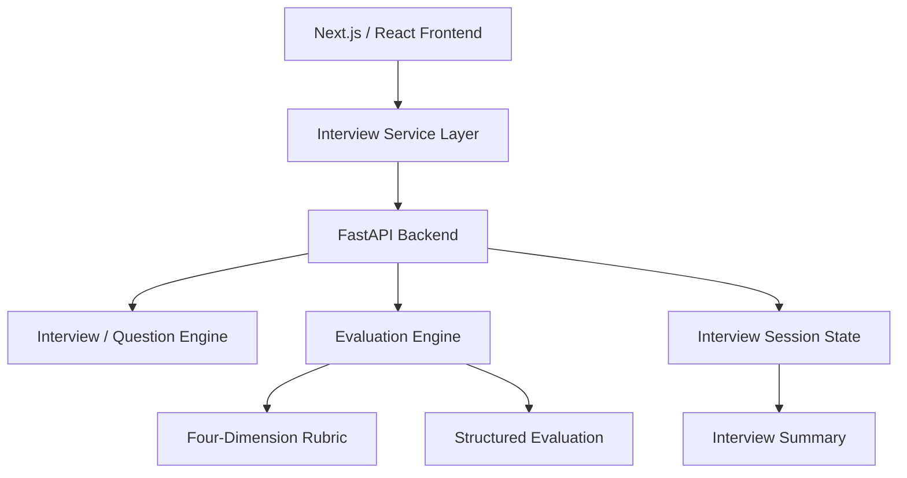

<div align="center">

# 🚀 AI Interview Coach

### Structured Product Management Interview Practice

**Practice one question at a time. Answer like a real interview. Get evidence-based feedback.**

[](#)
[](#)
[](#)
[](#)

</div>

---

## 🎯 What is AI Interview Coach?

AI Interview Coach is a working MVP for Product Managers preparing for interviews.

The product turns candidate context and a target role into a short mock interview. The candidate answers **one question at a time**, receives structured evaluation, and finishes with an interview-level readiness score.

The core product loop is:

```text
Candidate Context
      ↓
Mock Interview
      ↓
Question 1
      ↓
Candidate Answer
      ↓
Structured Evaluation
      ↓
Next Question
      ↓
Question 2
      ↓
...
      ↓
Interview Summary
```

The MVP is intentionally focused on validating this core loop rather than building a large interview platform.

---

## 💡 The Problem

Product interview preparation is often subjective.

Candidates commonly:

- practice generic questions
- memorize frameworks without practicing decision-making
- receive inconsistent feedback
- struggle to understand why an answer is weak
- have no repeatable way to measure performance

The product hypothesis is:

> **If interview practice uses a consistent evaluation rubric and evidence-based feedback, candidates can identify and improve answer-quality gaps more effectively than with generic practice alone.**

---

## 👤 Target User

The initial target user is a Product Manager preparing for interviews.

The MVP is relevant to:

- Associate Product Managers
- Product Managers
- Senior Product Managers
- Group Product Managers
- AI Product Managers
- Product Analysts

---

## ✨ Working MVP

### Onboarding

The candidate provides:

- Professional history / resume context
- Target Job Description
- Target role

### Interview

The product:

- generates a short mock interview
- presents **one question at a time**
- shows the relevant framework / areas of depth
- captures the candidate's answer
- evaluates the answer
- allows progression to the next question

### Evaluation

Every answer is evaluated across four dimensions:

| Dimension | What it measures |
|---|---|
| **Relevance** | Does the answer directly address the question? |
| **Structure** | Is the reasoning/story coherent? |
| **Specificity** | Does the candidate demonstrate personal actions and evidence? |
| **Business Impact** | Does the answer demonstrate a credible outcome or measurable impact? |

Each dimension is scored from **0–5**.

The question score is the average of the four dimensions.

The interview score is the average of the **unique completed question scores**.

---

## 🧪 MVP Validation

The MVP was tested with deliberately different answer qualities.

| Test | Answer quality | Observed result |
|---|---|---:|
| 1 | Extremely short / insufficient evidence | **0.0** |
| 2 | Relevant but generic | **~2.5** |
| 3 | Strong structured answer | **~4.3–4.4** |
| 4 | Strong answer with business evidence | **~4.3** |

The end-to-end flow was also validated:

```text
Q1 → Evaluation
Q2 → Evaluation
Q3 → Evaluation
        ↓
3 of 3 completed
        ↓
Final score = average of Q1 + Q2 + Q3
```

Example validated result:

```text
Q1 = 0.0
Q2 = 2.5
Q3 = 4.4

Final = 2.3 / 5
```

A particularly important failure mode was also fixed: duplicate evaluation events could previously inflate completion counts. The final implementation aggregates unique question results.

---

## 🧠 Evaluation Philosophy

The product is designed around **evidence over praise**.

The evaluator should not reward:

- answer length by itself
- generic confidence
- keywords without evidence
- invented achievements or metrics

An answer such as:

> "I worked with the team and launched the feature."

may be relevant, but it does not by itself demonstrate strong personal ownership, decision-making, or business impact.

Similarly, an answer such as:

> "abc"

should be capable of receiving **0**, rather than an artificially positive score.

The full scoring specification is documented in [`docs/Evaluation-Framework.md`](docs/Evaluation-Framework.md).

---

## 🏗 System Architecture



### Frontend

- Next.js
- React
- JavaScript
- Tailwind CSS

### Backend

- Python
- FastAPI
- Pydantic
- Uvicorn

### Development

- Git
- GitHub
- VS Code
- Python virtual environment

---

## 📂 Repository Structure

```text
AI-Interview-Coach/
│
├── docs/
│   ├── AI-Workflow.md
│   ├── Evaluation-Framework.md
│   ├── Executive-Summary.md
│   ├── Launch-Strategy.md
│   ├── Market-Research.md
│   ├── Metrics-and-Analytics.md
│   ├── Portfolio-Case-Study.md
│   ├── Problem-Statement.md
│   ├── Product-Requirements-Document.md
│   ├── Product-Roadmap.md
│   ├── Product-Vision.md
│   ├── Retrospective.md
│   ├── Sprint-Journal.md
│   ├── System-Architecture.md
│   ├── User-Personas.md
│   └── UX-User-Journey.md
│
├── src/
│   ├── backend/
│   ├── components/
│   ├── pages/
│   ├── services/
│   └── styles/
│
├── package.json
├── package-lock.json
├── requirements.txt
├── CHANGELOG.md
└── README.md
```

---

## 🚀 Run Locally

### 1. Install frontend dependencies

```bash
npm install
```

### 2. Create a Python virtual environment

```bash
python3 -m venv .venv
source .venv/bin/activate
```

### 3. Install backend dependencies

```bash
pip install -r requirements.txt
```

### 4. Start FastAPI

```bash
python -m uvicorn src.backend.main:app --reload --port 8000
```

Backend:

```text
http://localhost:8000
```

Swagger:

```text
http://localhost:8000/docs
```

### 5. Start Next.js

Open another terminal:

```bash
npm run dev
```

Frontend:

```text
http://localhost:3000
```

Both the frontend and backend need to be running for the complete interview flow.

---

## 📚 Product Documentation

The `/docs` directory documents the product from multiple perspectives.

### Product

- [Product Vision](docs/Product-Vision.md)
- [Problem Statement](docs/Problem-Statement.md)
- [Product Requirements Document](docs/Product-Requirements-Document.md)
- [User Personas](docs/User-Personas.md)
- [UX User Journey](docs/UX-User-Journey.md)

### AI & Evaluation

- [AI Workflow](docs/AI-Workflow.md)
- [Evaluation Framework](docs/Evaluation-Framework.md)
- [Metrics & Analytics](docs/Metrics-and-Analytics.md)

### Engineering

- [System Architecture](docs/System-Architecture.md)

### Product Delivery

- [Product Roadmap](docs/Product-Roadmap.md)
- [Launch Strategy](docs/Launch-Strategy.md)
- [Sprint Journal](docs/Sprint-Journal.md)
- [Retrospective](docs/Retrospective.md)

### Portfolio

- [Portfolio Case Study](docs/Portfolio-Case-Study.md)

---

## 🔍 What I Learned Building It

The most important lesson was that a technically functional feature is not automatically a usable product.

The MVP went through several iterations around:

- sequential interview state
- answer evaluation
- insufficient-answer handling
- score discrimination
- duplicate result aggregation
- final interview summary

The final product loop was validated end-to-end rather than stopping at successful API responses.

---

## 🛣️ Next Product Iteration

The highest-value next step is **evaluation calibration**, not simply adding more features.

Potential next iterations:

1. Build a human-rated PM interview answer dataset.
2. Compare AI scores with experienced interviewer scores.
3. Measure score agreement and false positives/negatives.
4. Improve evaluation prompts/rules based on observed gaps.
5. Personalize questions using seniority, company, role and JD context.
6. Track improvement across repeated interview attempts.

The long-term product metric is:

> **Does repeated practice measurably improve interview performance?**

---

## ⚠️ MVP Scope & Limitations

This repository represents a **working MVP**, not a production interview platform.

Current limitations include:

- no authentication
- no persistent user history
- limited question set for demonstration
- evaluation calibration is still required against human reviewers
- no voice interview
- no recruiter dashboard
- no longitudinal performance analytics

These limitations are intentional boundaries of the MVP.

---

## 👋 About the Project

This project was built to demonstrate the intersection of:

**Product Management + AI Evaluation + UX + Full-Stack Product Development**

The interesting part is not simply generating interview questions.

It is designing and validating an end-to-end product loop where:

```text
Problem
  ↓
Product Hypothesis
  ↓
UX
  ↓
Evaluation Rubric
  ↓
Implementation
  ↓
Testing
  ↓
Iteration
  ↓
Working MVP
```

For the detailed product story, see the [Portfolio Case Study](docs/Portfolio-Case-Study.md).
