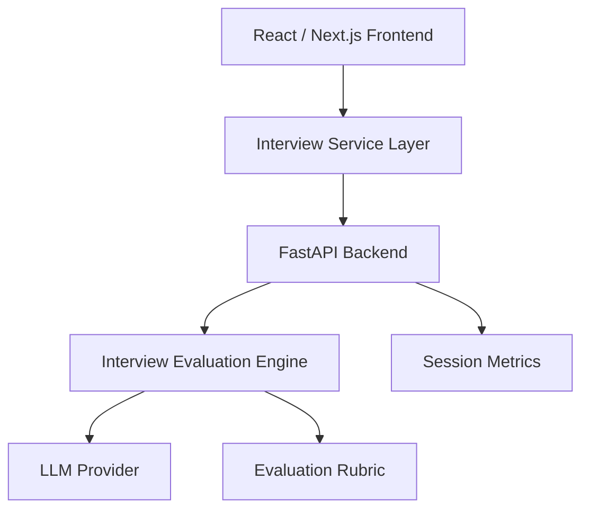

<div align="center">

# 🚀 AI Interview Coach

### Practice Product Management Interviews with AI

An AI-powered interview preparation platform that generates personalized mock interviews, evaluates answers using structured rubrics, and provides actionable feedback to help Product Managers improve interview performance.

---


</div>

---

# 🎯 Why this Project?

Interview preparation for Product Managers is largely subjective.

Candidates typically:

- Practice alone
- Memorize frameworks
- Ask friends for mock interviews
- Receive inconsistent feedback
- Have no objective way to measure improvement

AI Interview Coach aims to solve this problem by acting as an intelligent interview partner that provides structured, measurable and repeatable feedback.

---

# ✨ Vision

Build an AI Interview Coach capable of:

- Understanding a candidate's resume
- Understanding the target Job Description
- Generating role-specific interview questions
- Asking intelligent follow-up questions
- Evaluating every answer
- Providing actionable coaching
- Tracking interview improvement over time

---

# 👥 Target Users

- Associate Product Managers (APM)
- Product Managers (PM)
- Senior Product Managers (SPM)
- Group Product Managers (GPM)
- AI Product Managers
- Product Analysts

---

# 🚀 Current MVP

Current capabilities include:

- Resume input
- Job Description input
- Target role selection
- Mock interview initialization
- End-to-end Frontend ↔ Backend integration
- FastAPI API layer
- Modular service layer
- Environment configuration
- Mock interview generation

---

# 🖥 Product Walkthrough

```text
Paste Resume
        │
Paste Job Description
        │
Select Target Role
        │
Start Interview
        │
Generate AI Questions
        │
Answer Questions
        │
Receive Structured Feedback
        │
Improve Interview Performance
```

---

# 🏗 System Architecture



---

# 🤖 AI Workflow

```text
Resume

+

Job Description

+

Target Role

↓

Question Generation

↓

Candidate Answer

↓

Evaluation Engine

↓

Rubric Scoring

↓

Structured Feedback

↓

Improved Answer

↓

Performance Summary
```

---

# 📊 Evaluation Framework

Every interview response is evaluated across five dimensions.

| Dimension | Description |
|------------|-------------|
| Relevance | Did the answer address the question? |
| Structure | STAR / Framework quality |
| Specificity | Metrics, numbers and examples |
| Business Impact | Customer & business outcomes |
| Clarity | Conciseness and communication quality |

---

# 📈 Product Metrics

The product is designed to track:

- Interview completion rate
- Average score improvement
- AI feedback helpfulness
- Time to complete an interview
- Number of follow-up questions
- Candidate readiness score

---

# 🛠 Technology Stack

## Frontend

- Next.js
- React
- JavaScript

## Backend

- FastAPI
- Python
- Pydantic

## AI Layer

- LLM-ready evaluation engine
- Structured scoring framework

## Development

- Git
- GitHub
- VS Code
- Environment Variables

---

# 📂 Project Structure

```text
AI-Interview-Coach

├── docs/
├── models/
├── schemas/
├── src/
│   ├── backend/
│   ├── components/
│   ├── pages/
│   └── services/
├── CHANGELOG.md
├── package.json
├── requirements.txt
└── README.md
```

---

# 🚀 Local Development

Clone the repository

```bash
git clone https://github.com/vibecodepm/AI-Interview-Coach.git
```

Move into the project

```bash
cd AI-Interview-Coach
```

Install frontend dependencies

```bash
npm install
```

Create Python environment

```bash
python3 -m venv venv

source venv/bin/activate
```

Install backend dependencies

```bash
pip install -r requirements.txt
```

Configure environment

```bash
cp .env.local.example .env.local
```

Start backend

```bash
uvicorn src.backend.main:app --reload
```

Start frontend

```bash
npm run dev
```

Application URLs

Frontend

```
http://localhost:3000
```

Backend

```
http://localhost:8000
```

Swagger

```
http://localhost:8000/docs
```

---

# 🛣 Product Roadmap

## ✅ Phase 1 — Foundation

- Project scaffold
- Next.js
- FastAPI
- Service Layer
- Environment Configuration
- API Integration

---

## 🚧 Phase 2 — Interview Experience

- Answer submission
- AI evaluation
- Structured feedback
- Better answer rewrite

---

## 🔜 Phase 3 — AI Enhancement

- Resume PDF parsing
- Voice interviews
- Company-specific interview packs
- Context memory
- AI confidence scoring

---

## 🌍 Phase 4 — Product Scale

- User authentication
- Interview history
- Analytics dashboard
- Personalized recommendations
- Admin dashboard

---

# 📖 Product Management Artifacts

This repository is being built as a **Product Management portfolio project**, not just a coding exercise.

Alongside the application, the repository will include:

- Product Vision
- Product Requirements Document (PRD)
- User Personas
- User Journey
- System Architecture
- AI Workflow
- Evaluation Rubrics
- Product Metrics
- Sprint Logs
- Release Notes
- User Feedback
- Product Roadmap

---

# 🌟 Why This Project Stands Out

Unlike most AI interview assistants, this project focuses on **product thinking** as much as engineering.

It combines:

- AI workflows
- Structured evaluation systems
- Product strategy
- Full-stack development
- User-centric design
- Measurable success metrics

The goal is to demonstrate how AI products should be designed, built and iterated—not simply how to call an LLM.

---

# 📅 Current Status

✅ MVP Vertical Slice Complete

Current milestone:

- Working Frontend
- Working Backend
- End-to-end Interview Startup Flow
- Modular Service Layer
- Production-ready Project Structure

Next milestone:

> Interactive answer evaluation with structured AI feedback.

---

# 👨‍💻 Author

****


Building AI-powered products that combine Product Thinking, AI Systems and Full-Stack Engineering.

---

## ⭐ Support

If you found this project interesting, consider giving it a ⭐ on GitHub.

It motivates further development and helps others discover the project.
