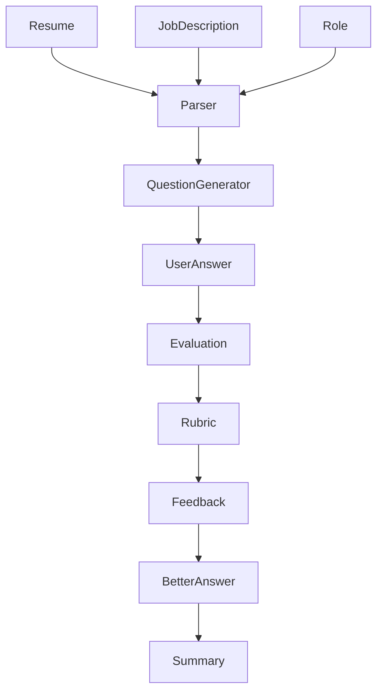

# AI Workflow

## Objective

Convert resume context and job requirements into a personalized interview experience with measurable feedback.

---

# End-to-End Workflow

---

# Workflow Steps

## Step 1

Collect Inputs

- Resume
- Job Description
- Target Role

---

## Step 2

Generate Interview Questions

Inputs are transformed into role-specific interview questions.

---

## Step 3

Capture Candidate Answer

Current

Text

Future

Voice + STT

---

## Step 4

Evaluate Response

Each response is evaluated against a structured rubric.

---

## Step 5

Generate Feedback

Feedback includes

- Strengths
- Weaknesses
- Missing information
- Suggested improvements

---

## Step 6

Rewrite Answer

Produce an improved version while remaining grounded in the candidate's experience.

---

## Step 7

Update Metrics

Session metrics are updated for long-term improvement tracking.

---

# Guardrails

- Never invent resume achievements
- Explain every score
- Confidence-aware feedback
- Manual review supported