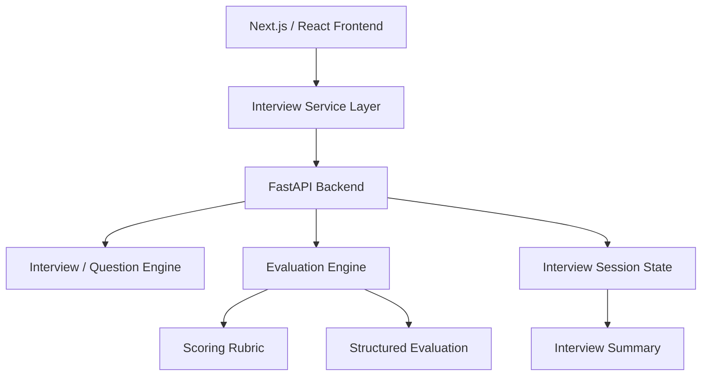

# AI Interview Coach — Product Case Study

## From Interview Practice to an Evidence-Based Performance Engine

### Executive Summary

AI Interview Coach is a product-management-focused AI interview practice platform.

The MVP helps a Product Manager prepare for an interview by:

1. providing role-contextual interview questions
2. presenting one question at a time
3. allowing the candidate to answer as they would in a real interview
4. evaluating the response across four explicit dimensions
5. providing evidence-based feedback
6. moving through a complete mock interview
7. producing an interview-level readiness summary

The project was intentionally built as a **product + engineering portfolio project**, rather than simply an LLM wrapper.

---

# 1. Problem

Product interview preparation is often highly subjective.

Candidates commonly:

- practice alone
- memorize frameworks
- use generic question banks
- receive inconsistent feedback
- struggle to understand why an answer is weak
- have no repeatable way to measure improvement

The core product problem is therefore not simply:

> "How do we generate interview questions?"

It is:

> **How might we create a repeatable interview practice experience that evaluates the quality of a candidate's evidence and reasoning rather than simply generating generic AI feedback?**

---

# 2. Target User

The initial target user is a Product Manager preparing for interviews.

Primary personas include:

- Associate Product Managers
- Product Managers
- Senior Product Managers
- Group Product Managers
- AI Product Managers
- Product Analysts

The MVP focuses on the **PM / Senior PM interview preparation** use case.

---

# 3. User Job-to-be-Done

> When I am preparing for a Product Management interview, I want to practice realistic questions and receive structured feedback on the quality of my answers, so that I can identify gaps and improve before the actual interview.

---

# 4. Product Hypothesis

### Hypothesis

If candidates receive:

- questions grounded in their role context
- one-question-at-a-time interview flow
- explicit evaluation criteria
- evidence-based feedback
- measurable scores

then interview practice will become more actionable than relying on generic question banks or unstructured AI feedback.

---

# 5. Product Strategy

The MVP deliberately focuses on one narrow loop:

```text
Prepare
   ↓
Answer
   ↓
Evaluate
   ↓
Learn
   ↓
Next Question
```

Rather than attempting to build a complete interview platform immediately, the MVP validates the core behavioral loop first.

---

# 6. MVP Scope

## Included

- Professional history / resume context
- Job description context
- Target role
- Mock interview generation
- Sequential interview experience
- One question at a time
- Answer submission
- Four-dimensional evaluation
- Evidence-based feedback
- Interview-level score
- Completion tracking
- Interview summary
- Restart / new interview flow

## Deliberately Not Required for MVP

- Authentication
- Persistent user accounts
- Voice interview
- Real-time conversational interviewer
- Company-specific interview libraries
- Long-term user analytics
- Production-scale model infrastructure

These can be added after the core product loop is validated.

---

# 7. User Experience

The final interview experience is intentionally sequential.

```text
Question 1
    ↓
Candidate Answer
    ↓
AI Evaluation
    ↓
Feedback
    ↓
Next Question
    ↓
Question 2
    ↓
...
    ↓
Interview Summary
```

The candidate does not see every question at once.

This makes the interaction behave more like an interview and less like a static questionnaire.

---

# 8. Important UX Iteration

### Initial implementation

The first implementation rendered all generated questions together.

This created a poor interview experience because:

- the candidate could see the entire question set
- the page behaved like a questionnaire
- there was no sense of interview progression
- answer state was harder to reason about

### Product decision

The experience was redesigned around a single active question.

The UI now exposes:

```text
Question 1 of 3
```

and requires the candidate to submit an answer before progressing.

### Result

The MVP now has a clear interview loop:

```text
Question → Answer → Evaluation → Next Question
```

This was an important product decision because the interaction model is part of the product value, not merely a UI detail.

---

# 9. Evaluation Framework

Each answer is evaluated across four dimensions.

| Dimension | Focus |
|---|---|
| Relevance | Did the candidate answer the actual question? |
| Structure | Is the reasoning/story coherent? |
| Specificity | Did the candidate explain personal actions and provide evidence? |
| Business Impact | Did the candidate demonstrate an outcome or measurable impact? |

Each dimension is scored from **0 to 5**.

The answer score is the average of the four dimensions.

```text
Answer Score =
(Relevance + Structure + Specificity + Business Impact) / 4
```

The complete scoring framework is documented separately in:

`docs/Evaluation-Framework.md`

---

# 10. Evidence Over Praise

A central product principle is:

> **The evaluator should reward evidence, not confidence or verbosity.**

For example:

```text
"We launched the feature successfully."
```

does not demonstrate:

- what the candidate personally did
- why the decision was made
- what trade-offs existed
- what outcome occurred

Therefore, a response like this should not automatically receive a high score.

Similarly:

```text
"abc"
```

must not receive a positive evaluation simply because the system is trying to be encouraging.

The MVP was explicitly tested for this behavior and returned:

```text
0.0 / 5
```

with feedback explaining that there was insufficient evidence.

---

# 11. Evaluation Examples

Observed MVP tests included:

### Test 1 — Insufficient answer

Very short response.

```text
Score: 0.0
```

The system identified the absence of sufficient evidence.

---

### Test 2 — Generic answer

Example:

> Our competitor launched a new feature so we changed our roadmap. I worked with the team and launched the new feature.

Observed score:

```text
~2.2–2.5 / 5
```

The answer was relevant, but lacked sufficient stakeholder detail, personal decision-making and measurable impact.

---

### Test 3 — Strong structured answer

A detailed answer with:

- market context
- analysis
- prioritization
- stakeholder alignment
- execution
- measurable result

Observed score:

```text
~4.3–4.4 / 5
```

This demonstrated that the evaluator can differentiate a strong evidence-rich answer from a generic response.

---

# 12. System Architecture



The architecture separates:

- presentation
- frontend service calls
- backend API
- evaluation logic
- scoring rules
- session-level aggregation

This allows the evaluation system to evolve without coupling the UI directly to scoring logic.

---

# 13. Technical Stack

## Frontend

- Next.js
- React
- JavaScript
- Tailwind CSS

## Backend

- FastAPI
- Python
- Pydantic

## Development

- Git
- GitHub
- VS Code
- Python virtual environment
- Environment variables

---

# 14. Product State Management

The interview experience maintains:

```text
questions
currentIndex
currentQuestion
answer
evaluation
results
```

The critical state transition is:

```text
Current Question
      ↓
Submit Answer
      ↓
Store Evaluation
      ↓
Store Question Result
      ↓
Advance Index
      ↓
Render Next Question
```

Interview-level aggregation operates on the completed question results rather than blindly counting evaluation events.

This prevents duplicate evaluation events from inflating the final completion count.

---

# 15. Interview Summary

The final screen provides:

- overall score
- number of questions completed
- average Relevance score
- average Structure score
- average Specificity score
- average Business Impact score

Example:

```text
Overall Score       2.3 / 5
Questions Completed 3 of 3

Relevance           2.6 / 5
Structure            2.6 / 5
Specificity          2.3 / 5
Business Impact      2.2 / 5
```

This gives the candidate a compact view of their performance across the interview.

---

# 16. What Did Not Work

Several iterations were necessary before the MVP behaved correctly.

## Problem 1 — All questions rendered simultaneously

### Issue

The UI initially displayed all generated questions.

### Resolution

Introduced a current-question model and sequential navigation.

---

## Problem 2 — Evaluation accepted extremely short answers too generously

### Issue

Very short responses could receive an artificially positive score.

### Resolution

Introduced insufficient-evidence handling and explicit low-score behavior.

---

## Problem 3 — Interview summary counted duplicate results

### Issue

Multiple evaluation events could cause the summary to display values such as:

```text
6 of 3 questions completed
```

### Resolution

The summary was changed to aggregate unique completed questions using question identity/index.

---

## Problem 4 — Scoring did not initially distinguish answer quality strongly enough

### Issue

Generic responses could receive scores that were too generous.

### Resolution

Strengthened the evaluation rubric around:

- evidence
- personal ownership
- specificity
- measurable outcomes
- relevance to the actual question

---

# 17. Validation Approach

The MVP was validated manually using representative responses across the quality spectrum.

### Test categories

```text
Insufficient
     ↓
Generic
     ↓
Developing
     ↓
Strong
```

The goal was not simply to verify that the API returned a response.

The goal was to verify that:

1. a weak answer can receive a weak score
2. an irrelevant/insufficient answer can receive zero
3. a generic answer does not receive a high score
4. a strong answer can receive a high score
5. the interview summary correctly aggregates completed questions

---

# 18. Current MVP Status

The core vertical slice is working:

```text
Preparation Inputs
      ↓
Mock Interview
      ↓
Question 1
      ↓
Answer
      ↓
Evaluation
      ↓
Question 2
      ↓
Answer
      ↓
Evaluation
      ↓
Question 3
      ↓
Answer
      ↓
Evaluation
      ↓
Interview Summary
```

The project can be run locally with a Next.js frontend and FastAPI backend.

---

# 19. Current Limitations

The current MVP is intentionally not a production-scale platform.

Known limitations include:

- session state is not yet a persistent user history
- evaluation quality still requires broader calibration
- LLM/model behavior can vary
- human evaluation feedback is not yet incorporated into automated calibration
- authentication is not implemented
- voice interaction is not implemented
- long-term performance analytics are not implemented

These limitations are acceptable for the current MVP because the primary product hypothesis is the structured interview-evaluation loop.

---

# 20. Next Product Iteration

The next improvements should prioritize learning quality rather than simply adding more features.

### Priority 1 — Evaluation calibration

Build a representative evaluation dataset and compare AI scores with human PM/interviewer assessments.

### Priority 2 — Better coaching

Move beyond scoring toward:

```text
What was weak?
Why was it weak?
What evidence was missing?
How could the answer be improved?
```

### Priority 3 — Interview personalization

Increase question quality using:

- target company
- seniority
- role type
- candidate experience
- job description
- interview category

### Priority 4 — Longitudinal improvement

Track:

```text
Attempt 1
   ↓
Feedback
   ↓
Attempt 2
   ↓
Score improvement
```

The product should eventually measure whether the candidate actually improves.

---

# 21. Success Metrics

The product should eventually measure:

## User Value

- interview completion rate
- repeat interview rate
- score improvement across attempts
- feedback helpfulness
- candidate confidence improvement

## Product Quality

- human/AI score agreement
- false-positive rate
- false-negative rate
- evaluation consistency
- question relevance

## Engagement

- interviews per user
- questions answered per session
- time per interview
- return rate

The most important metric should ultimately be:

> **Improvement in interview performance across repeated practice sessions.**

---

# 22. PM Learnings

### 1. The core loop matters more than feature count

A narrow working experience is more valuable than a broad collection of unfinished AI features.

### 2. AI needs an explicit evaluation contract

Without a clear rubric, "AI feedback" becomes subjective.

### 3. Evidence must drive scoring

A polished answer is not necessarily a strong answer.

### 4. Product state is part of UX

Question progression, evaluation state and completion state must be treated as product behavior rather than implementation details.

### 5. Validation must include bad inputs

Testing only good answers can hide the most important failure modes.

### 6. AI products need calibration

A working model response is not the same thing as a reliable product capability.

---

# 23. Portfolio Positioning

This project demonstrates a combination of:

- Product discovery
- Problem framing
- UX design
- Product requirements
- AI evaluation design
- Full-stack implementation
- API architecture
- Experimentation
- Failure-mode analysis
- MVP validation
- Product iteration

The important story is not:

> "I built an AI interview app."

It is:

> **"I identified a subjective product problem, designed an evidence-based evaluation system, built the end-to-end experience, tested failure modes, and iterated the product until the core interview loop became usable."**

---

# 24. Repository Documentation

Supporting product artifacts are maintained in the `/docs` directory.

Key documents include:

- `Product-Vision.md`
- `Problem-Statement.md`
- `Product-Requirements-Document.md`
- `User-Personas.md`
- `UX-User-Journey.md`
- `System-Architecture.md`
- `AI-Workflow.md`
- `Evaluation-Framework.md`
- `Metrics-and-Analytics.md`
- `Product-Roadmap.md`
- `Retrospective.md`
- `Sprint-Journal.md`
- `Portfolio-Case-Study.md`

Together, these documents demonstrate the product journey from problem definition through MVP implementation and validation.
