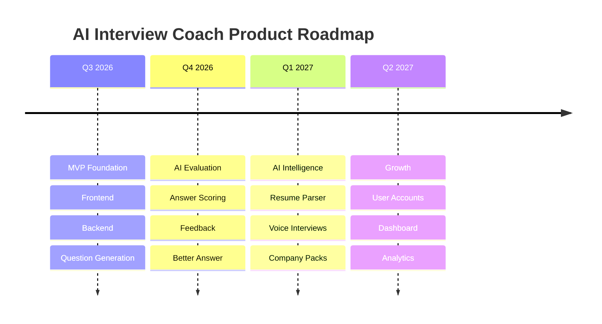

# Product Roadmap

**Product:** AI Interview Coach

**Owner:** Manu Sikarwar

**Document Version:** 1.0

**Status:** Active

---

# Product Vision

Build the leading AI-powered interview preparation platform for Product Managers by combining personalized interview generation, explainable AI evaluation, and measurable improvement.

---

# Roadmap Timeline

---

# Phase 1 — MVP Foundation ✅

Objectives

- Project setup
- Frontend
- Backend
- API integration
- Service layer
- Mock interview generation

Status

Completed

---

# Phase 2 — AI Coaching

Objectives

- Submit answer
- AI evaluation
- Structured scoring
- Better answer generation
- Interview summary

Success Metric

Average interview score improvement.

---

# Phase 3 — Personalization

Objectives

- Resume PDF parsing
- Resume grounding
- Voice interviews
- Adaptive follow-up questions

Success Metric

Higher interview completion rate.

---

# Phase 4 — Growth

Objectives

- Authentication
- Interview history
- Analytics dashboard
- Personalized recommendations

Success Metric

Monthly Active Users.

---

# Phase 5 — Scale

Objectives

- Multi-LLM support
- AI benchmarking
- Enterprise mode
- Interview packs
- Mobile application

Success Metric

User retention and NPS.

---

# Risks

| Risk | Impact | Mitigation |
|------|--------|------------|
| LLM Hallucination | High | Resume Grounding |
| AI Cost | Medium | Prompt Optimization |
| Poor Feedback Quality | High | Human Review |
| Slow Response Time | Medium | Response Streaming |

---

# Out of Scope

- Resume Builder
- Salary Negotiation
- Job Portal
- ATS Scanner

These may become future standalone products.