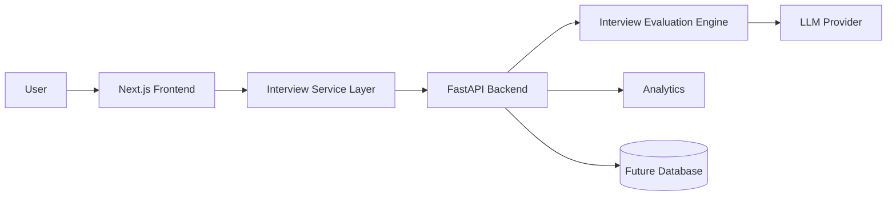

# System Architecture

## Overview

AI Interview Coach follows a modular architecture that separates presentation, business logic, AI evaluation, and future persistence layers. This enables independent evolution of each layer while keeping responsibilities clear.

---

# High-Level Architecture

---

# Components

## Frontend

Responsibilities:

- Resume input
- Job Description input
- Role selection
- Interview UI
- Display feedback

Technology

- Next.js
- React

---

## Service Layer

Responsibilities

- API abstraction
- Request handling
- Error handling
- Environment configuration

---

## FastAPI Backend

Responsibilities

- Routing
- Validation
- Session orchestration
- AI pipeline execution

---

## Evaluation Engine

Responsibilities

- Generate interview questions
- Evaluate answers
- Produce scores
- Generate rewritten answers

---

## LLM Provider

Current

- Mock implementation

Future

- OpenAI
- Anthropic
- Gemini
- Azure OpenAI

---

## Future Database

Purpose

- Session history
- User progress
- Metrics
- AI feedback
- Interview reports

---

# Architectural Principles

- Separation of concerns
- Stateless APIs
- Modular services
- Explainable AI
- Future provider independence